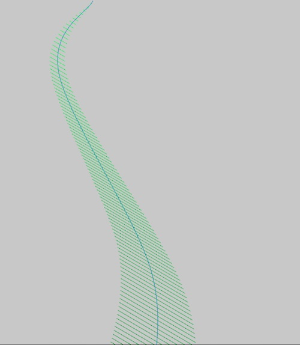

#Seaweed
Seaweed takes a look at using polylines and coordinate systems in order to draw and animate lifelike motions of biological objects. The movement is based on movement in the x positions of 2 different points moving in coordination to each other along with polylines obtaining the informatin needed to decend in size as it moves up.

